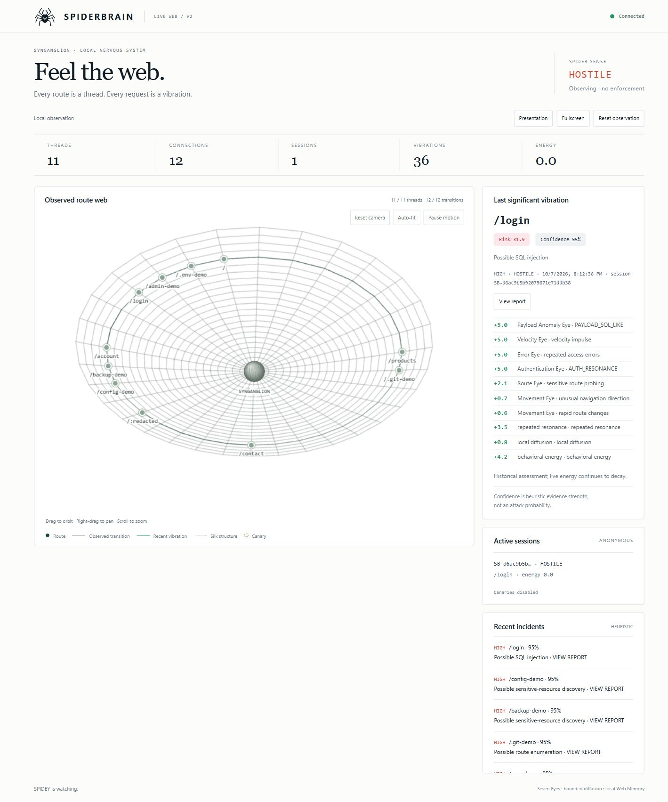
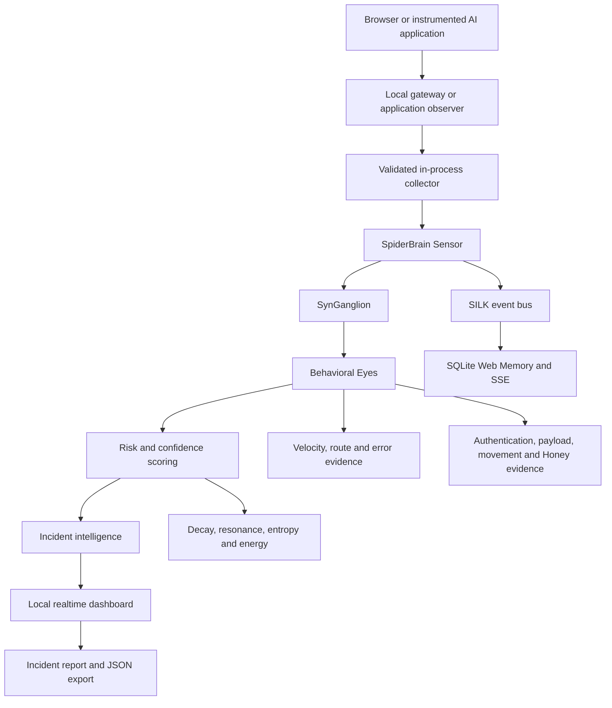
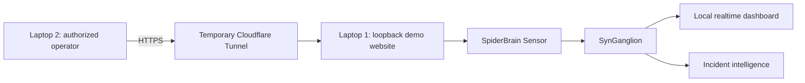

# SPIDERBRAIN

Real-time behavioral web and AI monitoring through **SynGanglion**.

**Author: Alnasrif Haliddin · [@Nasrif30](https://github.com/Nasrif30)**



Routes are threads. Requests are vibrations. Sessions accumulate behavioral energy. SpiderBrain correlates those signals into a live route web and explainable, sanitized incident reports. Its CLI supports local startup, monitoring and inspection.

Version **0.1.1** · TypeScript · Node **24.9+** · [MIT](LICENSE)

## Quick Start

Requires **Node.js 24.9 or newer** and npm. **`@naskilabot/spiderbrain@0.1.1` is published on npm.** Choose one of these options:

Install globally, then start the SpiderBrain dashboard:

```sh
npm install -g @naskilabot/spiderbrain
spiderbrain start --open
```

Run without installing globally:

```sh
npx @naskilabot/spiderbrain start --open
```

Monitor your own already-running local website:

```sh
spiderbrain monitor http://localhost:3000 --open
# Or without a global installation:
npx @naskilabot/spiderbrain monitor http://localhost:3000 --open
```

`start` runs the local dashboard, Sensor, SynGanglion, collector and incident engine. It starts no target website and generates no traffic. `monitor` creates a gateway for the explicit target you supply. Browse the **Monitoring Gateway** URL printed by SpiderBrain to generate observed traffic. Requests must pass through that gateway or an integrated sensor.

To build and install a local release tarball from a source checkout with dependencies installed:

```sh
npm run pack:release
npm install -g ./.spiderbrain/naskilabot-spiderbrain-0.1.1.tgz
spiderbrain start --open
```

For SDK integration in your application:

```sh
npm install @naskilabot/spiderbrain
```

See [Web Monitoring](#web-monitoring) for the Express integration example.

From source:

```sh
git clone https://github.com/Nasrif30/SPIDERBRAIN.git
cd SPIDERBRAIN
npm ci
npm run build
npm start -- --open
```

Dashboard: **http://127.0.0.1:5173/web**. Occupied preferred ports fall back to OS-selected loopback ports; use the URLs printed at startup. No port or target scanning occurs. The internal development website is started separately with `npm run demo` from source.

## Overview

SpiderBrain is a local security research platform for applications integrating its telemetry. Small mathematical models and independent behavioral Eyes feed SynGanglion, risk, confidence and state progression. No LLM, cloud service, Docker or external database is required.

## Why SpiderBrain

Related behavior across routes can reveal more than one request. SpiderBrain joins velocity, unsuccessful traversal, authentication outcomes, sanitized input anomalies and bounded history. It explains evidence before recommending a defensive response. It does not automatically block or retaliate.

## Live Demo Result

The owner reports a successful authorized two-laptop proof of concept. A second laptop browsed the synthetic application through a temporary Cloudflare Tunnel while the host processed live HTTP telemetry, route movement, state changes, incidents and JSON exports. This validates the demonstration pipeline, not production security effectiveness. Regression tests exercise the same local pipeline.

## Screenshots

The hero image is captured from the actual running application using explicitly generated local HTTP requests. [Live web](docs/images/live-web.png) and [incident report](docs/images/incident-report.png) show the same build. No AI mockup or fabricated detection is used. A two-laptop photograph is not referenced because no publishable capture was supplied.

## Architecture



The Sensor redacts before analysis or publication. SILK publishes sanitized decisions after sensing; SSE carries actual snapshots and pulses to the dashboard.

## How SpiderBrain Works

```text
HTTP traffic / explicit AI metadata
                 ↓
Gateway or application observer
                 ↓
Collector → Sensor → SynGanglion / Eyes
                 ↓
Risk + confidence → incident intelligence
                 ↓
Realtime web + reports + local memory
```

Vibration is a bounded `intensity × rarity × velocity × context` model. Energy decays exponentially. Repeated related evidence resonates. Bounded graph diffusion shares awareness without feedback. Entropy supports other signals and never independently proves hostility. Inertia requires evidence to advance and time plus clean behavior to recover.

## SynGanglion

The central behavioral correlation layer keeps bounded session histories, a directed route graph and decaying signal totals. States are `DORMANT`, `CALM`, `CURIOUS`, `ALERT`, `SUSPICIOUS`, `HOSTILE` and `TRAPPED` (reserved by the current watch-only response policy). Decisions carry contributions and reasons. This is deterministic mathematics, not artificial general intelligence.

## Behavioral Eyes

| Eye | Evidence |
| --- | --- |
| Velocity | Impulses and sustained request pressure |
| Route | Unsuccessful sensitive-route probing and missing-route diversity |
| Authentication | Explicit application failures, denials and anonymous identity changes |
| Error | Repeated 401/403/404 responses; 5xx alone is not visitor misconduct |
| Movement | Contextual unsuccessful navigation; rare successful browsing stays quiet |
| Honey | Explicitly enabled synthetic canary interactions |
| Payload Anomaly | Recognized SQL-like, script-like, traversal or shell-like structure flags |

Route/repeated resonance, navigation entropy and behavioral energy are supporting models, not extra Eyes. Each Eye contributes at most 5. Higher states need multiple Eyes and inertia; one anomaly cannot independently create HOSTILE.

## Web Monitoring

The Express SDK observes completed responses and explicit authentication outcomes. The zero-code gateway observes only requests forwarded through its fixed target. Both reuse the same Sensor/engine. Routes, transitions, timing, status, latency, anonymous cohorts and safe flags feed the web. Aborted requests and WebSocket messages are outside this release's coverage.

```ts
import express from 'express';
import { spiderbrain, noteAuthentication } from '@naskilabot/spiderbrain';

const app = express();
const guardian = spiderbrain({ dashboard: true, publicRoutes: ['/catalog'] });
app.use(guardian); // before application routes
app.get('/catalog', (_req, res) => res.send('Catalog'));
app.listen(3000, '127.0.0.1');
console.log(await guardian.ready); // selected local URLs

// In an existing authentication handler, after determining the outcome:
// noteAuthentication(res, { type: 'login_failure', identityKey: opaqueReference });
// On orderly application shutdown: await guardian.close();
```

Authentication is not guessed from status codes. Use opaque account references, not credentials. `publicRoutes` accepts trusted public literal segments, never user input. `Sensor`, `createSensor`, `Redactor` and framework-neutral `observe()` are exported. Adapters beyond Node/Express are future work.

## AI Monitoring

AI applications, gateways or agent runtimes must emit compatible metadata. SpiderBrain does not inspect arbitrary AI systems automatically. Supported types: `AI_MODEL_REQUEST`, `AI_MODEL_RESPONSE`, `AI_AGENT_ACTION`, `AI_TOOL_CALL`, `AI_TOOL_RESULT`, `AI_WORKFLOW_TRANSITION`, `AI_AUTH_EVENT`.

```ts
const guardian = spiderbrain({
  dashboard: true,
  publicAINames: ['demo-model', 'read_catalog'],
});
guardian.emit({
  type: 'AI_TOOL_CALL',
  sessionId: opaqueWorkflowReference,
  tool: 'read_catalog',
  durationMs: 12,
  status: 200,
});
```

Session references become anonymous. Names outside `publicAINames` become `redacted`. Safe metadata stays in a bounded 256-event runtime buffer exposed by `guardian.aiEvents()`. Events also become normalized request-like observations for existing velocity, status, route and energy models. There is no AI semantic classifier or prompt analysis. Authentication around AI services can use the explicit authentication API.

Prompts, outputs, tool arguments, tokens and arbitrary metadata objects are rejected. Sensitive-content capture is not supported. Event names do not independently assert malicious tool use.

## Risk vs Confidence

**Risk:** accumulated behavioral disturbance represented by displayed contributions.

**Confidence:** strength and consistency of supporting evidence, bounded at 95% by current heuristic calibration. It is **not attack probability**. Neither metric proves compromise or identity.

## Incident Intelligence

Fourteen heuristic labels cover possible SQL injection, authentication brute force, credential stuffing patterns, enumeration, sensitive-resource discovery, traversal, command injection, XSS, automated scanning, flooding, switching, abnormal navigation, restricted access and unknown anomalies. Labels require supporting behavior, not a route name alone.

Click a route, session or Recent incidents row to inspect route, anonymous session, assessment, severity, risk, confidence, evidence, signal contributions, HTTP behavior, timeline, state progression and recommendations. JSON filenames include incident ID and UTC date. No raw payloads or credentials are shown.

Quiet traffic preserves the timestamped **Last significant vibration**; live energy continues to decay. One significant report survives until reset/restart. The incident list holds at most 128 reports with 15-minute retention. This is not a permanent incident archive.

## Development Demo — source only

`apps/demo-site` is a separate synthetic React/Vite/Express test target retained in the source repository. Its client assets are excluded from the public npm package. Public `start` and `monitor` never start it. From a source checkout, explicitly run:

```sh
npm run demo
```

Development website: **http://127.0.0.1:4173/**; its separate dashboard defaults to **http://127.0.0.1:5173/web**. Use the printed URLs if preferred ports are occupied. Routes include `/`, `/products`, `/login`, `/account`, `/admin-demo`, `/.env-demo`, `/backup-demo` and `/config-demo`. Fictional accounts `demo`, `visitor`, `analyst` use the publicly documented demo-only password `lab-only`. Synthetic resource contents never read production secrets.

Presentation changes spacing/status size only. Fullscreen uses the browser API. **Reset observation** requires confirmation and clears transient sessions, graph activity, risk and reports. Stored Web Memory, configuration and downloaded exports survive. Restart to change environment settings.

## Installation

Requires Node **24.9+**, built-in SQLite and npm; Git for source cloning. Windows / Node 24.9.0 displays an experimental SQLite warning. `cloudflared` is optional for deliberate demonstrations. Cross-platform browser commands exist; default-browser opening has been verified on Windows.

## Local Testing

```sh
npm ci
npm run build
npm start -- --open
# Monitor an already running application:
npm run monitor -- http://localhost:3000 --open
```

`--port` sets the dashboard port for `start` or gateway port for `monitor`; `--dashboard-port` explicitly sets the dashboard port. `0` requests an available port. `--open` opens only the dashboard. For `monitor`, `--open-site` additionally opens the gateway to your target. Browser-open failure prints URLs and is nonfatal. Ctrl+C closes listeners, SSE connections and database. The CLI uses one foreground process.

## Two-Laptop Demonstration



Laptop 1 runs the application and watches the local dashboard; Laptop 2 visits the deliberately shared temporary website URL. This diagram represents the owner-reported demo. The temporary hostname is not included or assumed active.

## Remote Demo Mode

Local mode is default. Remote demonstration is a source-only development workflow; it does not affect public CLI startup. To deliberately expose the synthetic website, PowerShell:

```powershell
$env:SPIDERBRAIN_REMOTE_DEMO="1"
npm run demo
```

In a separate terminal, use the **actual website port printed at startup**:

```sh
cloudflared tunnel --url http://127.0.0.1:4173
```

Only the demo website relaxes public Host handling. Dashboard, telemetry, database and controls remain local. SpiderBrain never starts tunnels, creates public URLs or binds to `0.0.0.0`. Cloudflare headers are unverified hints, not authentication. Restore local mode by stopping, setting `$env:SPIDERBRAIN_REMOTE_DEMO="0"`, then restarting.

## Security Model

- Local Host/Origin checks protect dashboards/telemetry. Reset additionally requires same-origin POST and a runtime control token.
- Queries, cookies, authorization, IP addresses, raw identity references and private form contents are excluded from observations. The demo transiently checks bounded allowlisted input structure and discards values.
- Sensor failures fail open. Native middleware leaves the application independent. The proxy depends on its own foreground process for forwarding; if it stops, browse the original target directly.
- Anonymous cohorts can merge visitors behind NAT/tunnels and never identify people.
- SQLite metadata is local, bounded and not encrypted by SpiderBrain; review filesystem access before deployment.
- Canaries require explicit opt-in and fixed synthetic content. No payload execution, automatic enforcement or retaliation occurs.

The proxy forwards HTTP/HTTPS to an explicit fixed target. Remote upstreams require `--allow-remote` and authorization. No certificates, TLS MITM, interface monitoring or target discovery. WebSocket upgrades receive 426. Cookie domains, absolute application URLs, path-prefix redirects and application CSP may require native SDK integration.

## Project Structure

```text
apps/demo-site/       Synthetic website, collector, reports and presentation
packages/sensor/     Redaction, anonymous sessions, Sensor and local telemetry
packages/express/    Completed-response observer and explicit auth outcomes
packages/shared/     Observation and decision schemas
synganglion/         Eyes, physics, graph, scoring and Web Memory
silk/                Bounded isolated event bus
deception/           Opt-in synthetic canaries
dashboard/           Native WebGL/canvas web and SSE client
sdk/                 Express/AI APIs and fixed-target proxy
cli/                 CLI commands and default-browser launcher
arena/               Owned deterministic regression scenarios
tests/               Engine, privacy, integration and release tests
docs/                Real product screenshots
scripts/             Typecheck and package build
```

## Testing

```sh
npm test
npm run typecheck
npm run build
npm pack --dry-run
```

Coverage includes decay, caps, false-positive controls, fail-open redaction, state inertia, memory, HTTP/SSE, local/remote guards, reports, proxy, ports, reset, SDK and AI events. [Calibration notes](CALIBRATION.md) document research measurements and their limits.

## Limitations

Heuristics may miss threats or produce false positives. Detection proves neither compromise nor exploitation nor identity. There is no production enforcement, multi-user authenticated dashboard, encrypted incident archive or AI semantic classifier. WebSocket forwarding is unsupported. Current evidence is proof-of-concept validation; production needs additional hardening and application-specific evaluation. Quick Tunnels are temporary demonstrations.

## Roadmap

Persistent incident history, configurable policies, additional application/AI adapters, replay/graph analytics and continued performance/false-positive evaluation. These are future work.

## Responsible Use

Only monitor websites and applications you own or are explicitly authorized to test. SpiderBrain supports defensive research, education and integrated web/AI telemetry; it is not an exploitation framework.

## Author

**Alnasrif Haliddin** · GitHub: [@Nasrif30](https://github.com/Nasrif30)

## License

[MIT License](LICENSE). Copyright © 2026 Alnasrif Haliddin.
